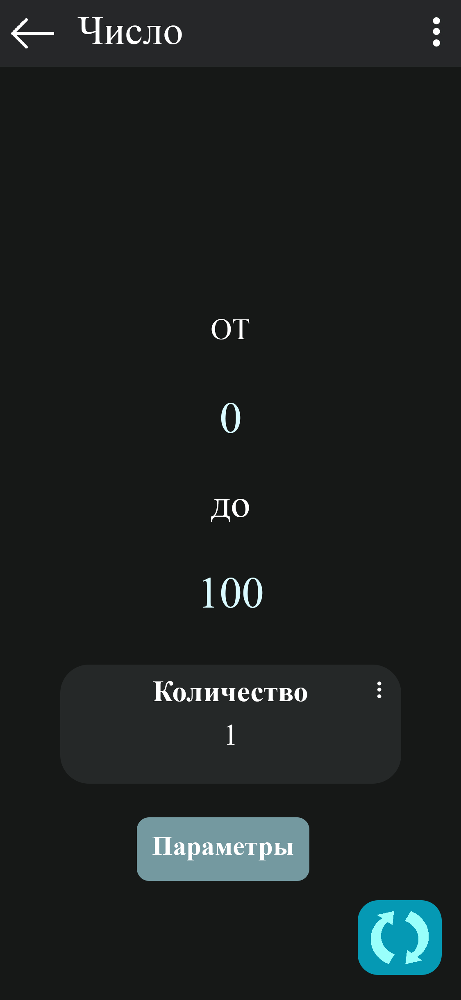
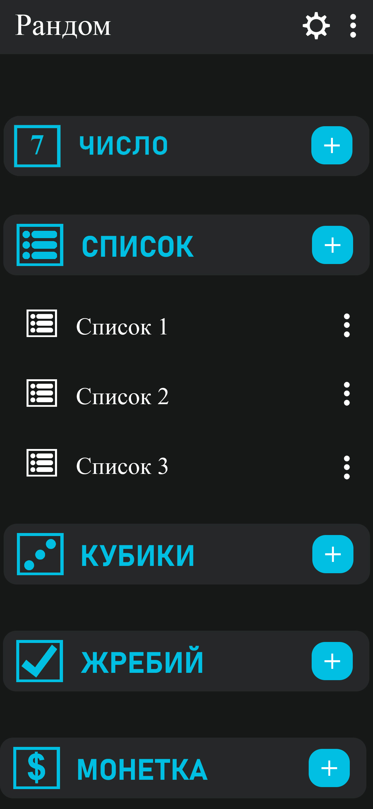

# Требования к проекту "WordListRandomizer"
---

# Содержание
1. [Введение](#intro)  
    1.1. [Назначение](#appointment)  
    1.2. [Бизнес-требования](#business_requirements)  
        1.2.1. [Исходные данные](#initial_data)  
        1.2.2. [Возможности](#business_opportunities)  
        1.2.3. [Границы проекта](#project_boundary)  
    1.3. [Аналоги](#analogues)  
2. [Требования пользователя](#user_requirements)  
    2.1. [Программные интерфейсы](#software_interfaces)  
    2.2. [Интерфейс пользователя](#user_interface)  
    2.3. [Характеристики пользователей](#user_specifications)  
        2.3.1. [Аудитория приложения](#application_audience)  
    2.4. [Предположения и зависимости](#assumptions_and_dependencies)  
3. [Системные требования](#system_requirements)  
    3.1. [Функциональные требования](#functional_requirements)  
        3.1.1. [Основные функции](#main_functions)  
            3.1.1.1. [Управление списками слов](#word_list_management)  
            3.1.1.2. [Отслеживание случайных слов](#random_word_tracking)  
            3.1.1.3. [Визуализация данных](#data_visualization)  
        3.1.2. [Ограничения и исключения](#restrictions_and_exclusions)  
    3.2. [Нефункциональные требования](#non-functional_requirements)  
        3.2.1. [Атрибуты качества](#quality_attributes)  
            3.2.1.1. [Требования к удобству использования](#requirements_for_ease_of_use)  
            3.2.1.2. [Требования к производительности](#performance_requirements)  
            3.2.1.3. [Требования к хранению данных](#data_storage_requirements)  
        3.2.2. [Внешние интерфейсы](#external_interfaces)  
        3.2.3. [Ограничения](#restrictions)
4. [Мокапы приложения](#mockups)

<a name="intro"/>

# 1. Введение

<a name="appointment"/>

## 1.1. Назначение
В этом документе описаны функциональные и нефункциональные требования к мобильному приложению для управления списками слов "WordListRandomizer". Этот документ предназначен для команды разработки, тестирования и всех заинтересованных сторон для обеспечения единого понимания целей и возможностей продукта.

<a name="business_requirements"/>

## 1.2. Бизнес-требования

<a name="initial_data"/>

### 1.2.1. Исходные данные
В современном мире люди часто сталкиваются с необходимостью запоминать слова для изучения языков, игр или других задач. Однако без удобного инструмента для управления списками и случайного выбора слов поддерживать интерес и эффективность может быть сложно. Пользователям нужен простой и интуитивно понятный способ создавать списки слов, добавлять их и получать случайные слова для практики.

<a name="business_opportunities"/>

### 1.2.2. Возможности
Приложение "WordListRandomizer" предоставляет пользователям удобный инструмент для создания списков слов, их управления и случайного выбора для тренировок или развлечений. Это помогает улучшить запоминание, делает процесс обучения или игры увлекательным и доступным для широкой аудитории благодаря простоте интерфейса и отсутствию сложных настроек.

<a name="project_boundary"/>

### 1.2.3. Границы проекта
Приложение "WordListRandomizer" является мобильным приложением для Android, позволяющим пользователям создавать несколько списков слов, добавлять новые слова, просматривать их в виде списка и получать случайное слово из выбранного списка. Приложение поддерживает базовую визуализацию списка слов через RecyclerView. В текущей версии не предусмотрены функции синхронизации между устройствами, сохранения данных в облаке или интеграции с другими приложениями. Все данные хранятся локально на устройстве пользователя.

<a name="analogues"/>

## 1.3. Аналоги
На рынке существуют приложения для управления словами и обучению языкам, такие как Anki, Quizlet и Memrise. "WordListRandomizer" отличается своей простотой, отсутствием необходимости в интернет-соединении для базовых функций и фокусом на случайном выборе слов без сложных обучающих алгоритмов.

<a name="user_requirements"/>

# 2. Требования пользователя

<a name="software_interfaces"/>

## 2.1. Программные интерфейсы
Приложение является самодостаточным и не требует взаимодействия с внешними программными сервисами или API. Взаимодействие с операционной системой ограничивается доступом к файловой системе для локального хранения данных (например, в SharedPreferences или JSON-файле).

<a name="user_interface"/>

## 2.2. Интерфейс пользователя
Интерфейс приложения состоит из одного основного экрана:

1. **Главный экран (Список разделов и слов):**
    * Отображает список разделов (например, "Слов", "Список", "Кубики", "Крестики", "Монетка") в виде карточек.
    * Каждая карточка содержит название, иконку, счетчик (для "Слов"), кнопку "+" для добавления и меню (для подсписков).
    * Позволяет добавлять новые слова или списки, получать случайное слово через FloatingActionButton и переходить к настройкам через меню в Toolbar.
    * При нажатии на карточку отображается список слов или подсписки (в зависимости от раздела).

<a name="user_specifications"/>

## 2.3. Характеристики пользователей

<a name="application_audience"/>

### 2.3.1. Аудитория приложения
Целевой аудиторией являются люди, изучающие языки, играющие в словесные игры или нуждающиеся в инструменте для случайного выбора слов. Это могут быть студенты, преподаватели, геймеры или просто любители креативных задач, которым нужен простой и удобный инструмент для работы со словами.

<a name="assumptions_and_dependencies"/>

## 2.4. Предположения и зависимости
1. Приложение рассчитано на использование одним пользователем на одном устройстве, так как не имеет системы учетных записей.
2. Корректная работа приложения зависит от наличия прав на чтение и запись в локальной памяти устройства.
3. Предполагается, что пользователь обладает базовыми навыками работы с мобильными устройствами для запуска приложения и взаимодействия с его интерфейсом.

<a name="system_requirements"/>

# 3. Системные требования

<a name="functional_requirements"/>

## 3.1. Функциональные требования

<a name="main_functions"/>

### 3.1.1. Основные функции

<a name="word_list_management"/>

#### 3.1.1.1. Управление списками слов
**Описание:** Пользователь может полностью контролировать свои списки слов.

| Функция | Требования |
| :--- | :--- |
| Создание нового списка | Приложение должно предоставлять возможность создать новый список слов, указав его название. |
| Добавление слова | Пользователь должен иметь возможность добавить слово в существующий список. |
| Редактирование списка | Пользователь должен иметь возможность изменять название списка. |
| Удаление списка | Пользователь должен иметь возможность удалить список. Перед удалением система должна запрашивать подтверждение действия. |

<a name="random_word_tracking"/>

#### 3.1.1.2. Отслеживание случайных слов
**Описание:** Пользователь может получать случайное слово из списка.

| Функция | Требования |
| :--- | :--- |
| Выбор случайного слова | Приложение должно предоставлять возможность получить случайное слово из выбранного списка по нажатию на кнопку. |
| Просмотр слова | Случайное слово должно отображаться на экране для использования пользователем. |

<a name="data_visualization"/>

#### 3.1.1.3. Визуализация данных
**Описание:** Пользователь может наглядно видеть свои списки.

| Функция | Требования |
| :--- | :--- |
| Отображение списка слов | Приложение должно отображать список слов в каждом разделе с использованием RecyclerView. |
| Счетчик слов | Для каждого списка должен отображаться текущий счетчик количества слов. |

<a name="restrictions_and_exclusions"/>

### 3.1.2. Ограничения и исключения
1. Приложение не поддерживает уведомления или напоминания.
2. Отсутствует возможность экспорта или импорта списков слов.
3. Отсутствует облачная синхронизация; все данные хранятся локально.

<a name="non-functional_requirements"/>

## 3.2. Нефункциональные требования

<a name="quality_attributes"/>

### 3.2.1. Атрибуты качества

<a name="requirements_for_ease_of_use"/>

#### 3.2.1.1. Требования к удобству использования
1. Интерфейс должен быть интуитивно понятным, без перегруженности элементами.
2. Все функциональные элементы (кнопки, поля ввода) должны иметь четкие и однозначные названия или иконки.
3. Навигация между разделами должна быть простой и логичной.

<a name="performance_requirements"/>

#### 3.2.1.2. Требования к производительности
1. Приложение должно запускаться быстро.
2. Время отклика на действия пользователя (нажатия кнопок, обновление списка) должно быть минимальным.
3. Отрисовка списка слов должна происходить плавно, без заметных задержек.

<a name="data_storage_requirements"/>

#### 3.2.1.3. Требования к хранению данных
1. Данные о списках слов должны сохраняться локально (например, в SharedPreferences или JSON-файле).
2. Приложение должно корректно обрабатывать ошибки чтения или записи данных, информируя пользователя о проблеме.
3. Приложение должно обеспечивать целостность данных при загрузке, пропуская поврежденные записи.

<a name="external_interfaces"/>

### 3.2.2. Внешние интерфейсы
Интерфейс приложения разработан с использованием Android Material Design, что обеспечивает современный внешний вид и поддержку тем (светлая/темная). Размер и начертание шрифтов подобраны для комфортного чтения на мобильных устройствах.

<a name="restrictions"/>

### 3.2.3. Ограничения
1. Приложение реализовано на языке Kotlin с использованием Android SDK.
2. Для работы приложения требуется устройство с Android 5.0 (API 21) и выше.
3. Приложение разработано как мобильное для Android; тестирование проводилось на эмуляторах и реальных устройствах.

# 4. Мокапы приложения

<a name="mockups"/>

